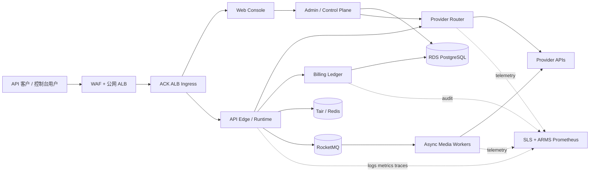

# NexusFlow 云原生与微服务架构 Spec

> 状态：Draft / 待评审
>
> 版本：v0.2
>
> 日期：2026-08-02
>
> 适用范围：NexusFlow API、客户控制台、管理端、Provider 路由、计费、异步媒体任务及可观测性
>
> 决策性质：目标架构与迁移约束；本文不代表已上线

## 1. 摘要与结论

NexusFlow 的目标形态是以阿里云 ACK Serverless Pro（ECI Pod）为当前主要计算底座、ACR 为镜像仓库、ALB Ingress 为公网入口，继续使用托管 RDS PostgreSQL、Tair/Redis、SLS，并按需接入 ARMS Prometheus、RocketMQ 与 MSE。流量和常驻资源达到明确阈值后，再比较固定节点 ACK/Auto Mode 的单位成本；应用 Helm 与服务边界不因底层计算形态变化而重写。

本次设计不把现有单体一次拆成大量服务，也不改变公开 API 地址。迁移遵循“先容器化并保证行为完全一致，再按扩缩容、数据一致性和故障域拆分”的顺序。MSE 是后续的流量治理和微服务治理层，不是承载应用实例的计算平台；第一阶段不引入 Nacos，也不让 MSE 成为迁移前置条件。

核心选择：

- 公网地址保持 `https://nexusflow.hk/v1/...` 不变。
- 首轮拆分最终只形成三个主要工作负载：Web、同步 API Runtime、异步 Worker；Phase 1 先只做 Web/Backend 容器等价，异步 Worker 到 Phase 4 再拆，控制面继续保留在现有后端中。
- 计费仍采用同步、权威的余额预占/结算/释放事务，不改成最终一致的异步扣费。
- Provider 路由可以动态配置，但配置发布必须有版本、审计、校验、灰度和一键回滚。
- 流式请求的扩缩容依据活跃流、并发、QPS、P95 和 Provider 容量，而不是只看 CPU。
- 每次发布只构建一次镜像并以 digest 部署，前后端版本和静态资源不得混发。
- ACK 上线前保留现有双 ECS 生产环境，使用影子流量与加权灰度验证；任何阶段都可回退。

## 2. 背景与目标

### 2.1 当前生产快照

截至 2026-08-02，当前生产拓扑为：

```text
Internet
  -> ALB
     -> ECS node A -> nginx -> Express/PM2 cluster + Next.js
     -> ECS node B -> nginx -> Express/PM2 cluster + Next.js
                         |-> RDS PostgreSQL 16
                         |-> Redis 5.0（现网基线，独立评审后再升级）
                         |-> Provider APIs
                         |-> SLS
```

已具备的关键能力：

- OpenAI/Anthropic 兼容入口，包括 `/v1/chat/completions`、`/v1/messages`、`/v1/responses` 等。
- API Key hash 验证、主/子账号权限、余额预占与结算、模型价格和客户折扣。
- Provider 容量、优先级、权重、健康度与成本参与路由评分。
- 双节点不可变 release、ALB 摘流、连接排空、原子软链接切换、数据库备份与恢复验证。
- PostgreSQL、Redis、SLS、PM2、CloudMonitor 基础监控。

当前限制：

- API 路由虽按模块组织，仍在同一 Express 部署中，不能按工作负载独立扩缩。
- 实际多数模型只有一个启用 Provider，动态路由能力存在，但冗余度不足。
- 管理端能查看路由权重/优先级，但完整的可视化变更、审批和回滚闭环仍需建设。
- 当前没有 Kubernetes 级自动扩缩容、Pod 生命周期治理和服务级资源隔离。
- SLS 已保留完整内容 7 天，但需补结构化索引、查询身份、敏感内容治理与告警闭环。

### 2.2 目标

1. 支持同步模型 API 和异步媒体任务分别横向扩容。
2. 在实例扩缩、发布、节点故障时不中断已有 SSE 流。
3. 保证计费、余额、折扣和上游成本在任何重试与故障下可核对。
4. 支持 Provider 权重、优先级、主备、灰度和手动切换，并避免错误健康降级。
5. 建立从公网、网关、服务、Provider、数据库到资金账本的全链路观测和告警。
6. 所有变更可审计、可灰度、可回滚，避免前后端版本混发和单节点漂移。
7. 为后续多地域、更多模型和企业客户隔离预留边界，但不提前制造不必要复杂度。

### 2.3 非目标

- 本期不做跨地域双活，也不承诺数据库多主。
- 本期不按每个 API 路径或每个模型拆一个微服务。
- 本期不重写业务框架，不把 Next.js 预览版升级与容器迁移绑定进行。
- 本期不把 PostgreSQL 拆成多个物理实例。
- 本期不为了“微服务”引入 Nacos、Service Mesh 或分布式事务。
- 本文不修改线上服务、价格或路由配置。

## 3. 设计原则与不可破坏不变量

### 3.1 业务与资金

- API Key 只使用 SHA-256 hash 验证，任何服务不得存储或记录明文 Key。
- 资金属于主账号；子账号仅作为消费 actor，受主账号余额、配额和模型白名单约束。
- 收费请求必须经历原子预占、结算、释放；禁止“先查余额、请求完成后再扣款”。
- 金额使用 PostgreSQL `NUMERIC`，账本保持至少 6 位精度。
- 同一业务请求必须有稳定 idempotency key；客户端重试、网关重试和 Worker 重投不能重复扣费。
- 折扣、缓存命中价、阶梯价、输入/输出/音频/视频等计价维度必须共享同一价本版本。
- 上游成本必须可解释：优先使用已生效的采购折扣；没有折扣时使用对应生效日期的官方原价。无法解析时标记 `unknown` 并报警，禁止当作 0。
- 流式请求只有确认产生输出时才允许估算缺失 usage，并记录 `estimated=true`、估算方法和证据。

### 3.2 请求与协议

- 公开域名和现有 `/v1` 接口保持兼容。
- 模型 ID 可能包含 `/`，网关、Ingress 和应用路由必须保留编码，禁止路径归一化破坏模型 ID。
- 流式响应必须正确结束 `finish_reason` 与 `[DONE]`；中途故障要输出协议允许的错误并停止写入。
- 客户端取消连接必须向上游传播 abort，并及时释放并发租约和资金预占。
- 已发送响应头后不得再走普通 JSON 错误路径，避免 `ERR_HTTP_HEADERS_SENT`。
- 只对明确可重试且尚未向客户端产生不可逆输出的请求进行重试；禁止盲目重放流式请求。

### 3.3 安全与隐私

- 管理写操作必须显式执行 admin 鉴权；用户资源必须校验 owner，失败关闭。
- Provider 出站域名必须在 allowlist 中；生产进程不得继承任意 HTTP(S)/ALL proxy。
- Secret 仅来自阿里云 KMS/Secrets Manager 或 Kubernetes Secret 的受控投射，不进入镜像、Git、日志和前端。
- 上传先鉴权再读取 body，下载采用流式转发，并保留请求体、连接数、速率和带宽限制。
- 日志默认记录元数据；需要保留的请求/响应内容必须分级授权、字段脱敏、长度限制并设置生命周期。

### 3.4 发布与运行

- 同一发布只构建一次，每个环境部署同一镜像 digest。
- 数据库迁移使用 expand/contract 模式；旧版本和新版本在灰度窗口内必须同时兼容 schema。
- 每个工作负载至少两个副本并跨可用区分布；资金服务禁止缩容到 0。
- readiness 只表示能否接新流量，liveness 不得因短暂 Provider/Redis/RDS 故障反复杀进程。
- 扩缩容或发布前先摘除 readiness，再停止接单并排空长连接。

## 4. 平台选型

### 4.1 当前选择 ACK Serverless Pro

ACK Serverless Pro + ECI 作为当前目标计算平台，理由如下：

- 适合部署多个具有不同扩缩容特征的容器工作负载。
- 当前流量下无需预购常驻 Worker ECS，按 Pod 实际规格和运行时间计费。
- 支持 HPA、自定义指标和弹性 Pod，仍保留标准 Kubernetes API。
- 可使用托管 ALB Ingress，保持当前 ALB 能力并获得声明式路由。
- 能用 Deployment、PDB、拓扑分布、NetworkPolicy 和 ServiceAccount 表达运行约束。
- 后续可平滑接入 MSE、Prometheus、GitOps 与多环境治理。

Serverless 不等于天然无风险。ECI 出网需要 NAT/SNAT，RDS/Redis 必须放行 Pod 地址段，ALB idle timeout 必须覆盖长 SSE，扩缩容不能只看 CPU。ACK Serverless Pro 控制面当前处于公测免管理费阶段，正式采购前必须重新确认价格；当常驻 Pod 成本持续高于固定节点时，评估迁移到 ACK Auto Mode/托管版节点池。

### 4.2 MSE 的定位

MSE 在以下需求出现时接入：

- 多个内部服务需要统一灰度、标签路由、限流、熔断和服务治理。
- 多团队需要通过网关管理 API、鉴权、路由策略和流量观测。
- 需要 Nacos 配置/注册中心承载非 Kubernetes 工作负载或跨集群服务发现。

第一阶段不接入 MSE 的原因：Kubernetes Service 已满足集群内服务发现，现有 ALB + 应用网关能力足以完成迁移；过早引入 MSE 会增加控制面和故障面。

### 4.3 SAE 的位置

SAE 可作为团队不准备维护 Kubernetes 时的低运维备选，支持容器部署、监控和弹性伸缩。但 NexusFlow 已明确需要多个独立工作负载、精细生命周期控制和长期大规模扩展，因此主方案采用 ACK，避免未来再做一次 SAE 到 ACK 的平台迁移。

## 5. 目标架构



### 5.1 服务边界

| 逻辑服务 | 首期形态 | 主要职责 | 扩缩容依据 | 权威数据 |
| --- | --- | --- | --- | --- |
| Web Console | 独立 Deployment | 官网、客户控制台、管理端 UI | RPS、CPU | 无 |
| API Edge / Runtime | 独立 Deployment | 鉴权、协议适配、同步/流式请求、超时与取消 | 活跃流、inflight、QPS、P95 | 请求状态，不拥有资金 |
| Provider Router | 首期与 Runtime 同进程，后期独立 | 候选 Provider、权重/优先级、容量租约、健康评分 | 路由 QPS、Redis 延迟 | 路由配置版本在 PG；热状态在 Redis |
| Billing Ledger | 首期模块化单体，最后独立 | 预占、结算、释放、账本、价本解析 | 事务 QPS、锁等待、DB 延迟 | PostgreSQL |
| Admin / Control Plane | 首期与后端同代码、独立路由 | 客户、模型、价格、路由、审计、运营配置 | 低 QPS，固定副本 | PostgreSQL |
| Async Media API | 第二阶段独立 | 视频/音频/图片任务接收、查询、回调 | API QPS | PostgreSQL |
| Async Media Worker | 第二阶段独立 | 拉取队列、调用上游、轮询、结果归档 | 队列 lag、任务年龄、Provider 配额 | PostgreSQL + MQ |

拆分原则：只有当工作负载具有不同扩缩容曲线、数据一致性边界、部署频率或故障隔离需求时才独立部署。`/v1/messages`、`/v1/chat/completions` 和 `/v1/responses` 都属于同步 Runtime，不按路径拆服务。

### 5.2 代码与部署单元

目标代码结构继续保持 monorepo；Phase 1 先构建 Web/API，Phase 4 再启用独立 Worker：

```text
apps/
  web/
  api-runtime/
  media-worker/
packages/
  auth/
  billing-domain/
  provider-routing/
  protocol-adapters/
  observability/
deploy/
  helm/nexusflow/
```

领域包不得直接互相访问私有表。首期同库时通过明确的 repository/service 接口约束；拆成独立服务后接口语义保持不变。

## 6. 核心请求流程

### 6.1 同步与流式模型请求

1. ALB/Ingress 校验 TLS、body size、连接数和入口速率。
2. Runtime 验证 API Key、账号状态、模型权限和请求大小。
3. 生成或接受稳定 request id；客户端 idempotency key 与账号共同形成去重键。
4. Billing 在一个数据库事务中解析生效价本并预占余额，记录 `pricing_version_id`。
5. Router 从已发布的路由配置版本选择候选 Provider，并在 Redis 获取有 TTL 的容量租约。
6. Runtime 发起上游请求；流式开始后记录首 token 时间和已输出证据。
7. 正常完成：解析 Provider usage，Billing 结算差额，释放预占和容量租约。
8. 上游失败：按错误分类决定是否在输出前切换候选；释放租约并结算/释放资金。
9. 客户端取消：abort 上游，保存取消状态；只有存在可靠 usage 或输出证据时才结算应计部分。
10. 事务后通过 outbox 异步发送审计、统计和告警事件。

任何日志、MQ 重投或统计任务都不能成为资金权威来源。

### 6.2 流式连接终止

Pod 收到终止信号后：

1. readiness 立即失败，Ingress 不再分配新请求。
2. 进入 draining 状态，保持已建立的 SSE 连接。
3. 等待活跃流归零；达到 `terminationGracePeriodSeconds` 前不强杀。
4. 超时仍未结束时，主动 abort 上游、记录 `termination_drain_timeout`，执行幂等结算/释放。
5. 进程退出前刷新必要 telemetry，但不能依赖日志写入来完成扣费。

建议初始排空窗口为 10 分钟，最终值由真实最长请求和压测结果确定；超长异步任务不得占用 SSE Pod。

### 6.3 异步媒体任务

1. API 鉴权并创建任务记录，事务内写入 outbox。
2. outbox publisher 将消息发布到 RocketMQ。
3. Worker 使用任务 ID 作为幂等键领取任务，获取 Provider 容量租约。
4. 提交上游后保存 provider task id，再执行轮询或接收回调。
5. 完成后原子更新结果和账本；重复消息只返回既有结果。
6. 超时任务进入可观测的 retry/dead-letter 状态，不允许无限重试。

### 6.4 计费状态机

```text
created -> reserved -> settled
                  \-> released
                  \-> partially_settled
```

规则：

- 每次状态转换都以 request id + operation type 唯一约束防重。
- `settled` 后重复结算返回原结果，不新增账本行。
- 价本和折扣使用请求开始时锁定的版本；发布新价格不影响在途请求。
- Provider 成本记录采购价格版本、折扣来源、官方价来源、生效时间和解析状态。
- 对账任务只发现差异并生成调整建议；自动调账需要独立授权和审计。

## 7. Provider 路由与健康治理

### 7.1 动态配置模型

每个 model-provider binding 至少包含：

- `enabled`、`priority`、`weight`。
- RPM、TPM、每日额度、并发上限。
- 单价版本与生效区间。
- 能力标签：stream、tools、vision、audio、context、region。
- 客户 allow/block、固定 Provider、优先级 boost。
- 健康状态、熔断状态和人工维护状态。

变更流程：草稿 → schema/业务校验 → 双人审批（生产资金相关项）→ 小流量发布 → 全量 → 可回滚。每次发布产生不可变版本和审计记录。

### 7.2 健康分类

| 类别 | 示例 | 是否降低 Provider 健康度 | 是否可重试/切换 |
| --- | --- | --- | --- |
| 客户端错误 | 400、非法消息、超上下文、无权限 | 否 | 通常否 |
| 平台策略错误 | 余额不足、模型禁用、租户限流 | 否 | 否 |
| Provider 容量错误 | 429、明确 quota exhausted | 是，按窗口 | 输出前可切换 |
| Provider 服务错误 | 5xx、连接失败、协议错误 | 是 | 输出前按策略切换 |
| 平台依赖错误 | Redis/RDS/SLS 故障 | 不归因 Provider | 按依赖策略 |
| 客户端取消 | disconnect/abort | 否 | 否 |

历史上“客户端 400 导致 Provider 降级”的行为必须由回归测试永久阻止。

### 7.3 容量状态语义

Redis 脚本必须在目标托管 Redis/Tair 版本上做兼容测试。容量层返回值必须区分：

- `acquired`：成功获取租约。
- `exhausted`：容量确实耗尽，可选其他 Provider。
- `state_unavailable`：Redis 或脚本不可用，触发平台依赖告警，不能伪装成 Provider 无容量。

是否在容量状态不可用时 fail-open 必须按模型配置；默认对有资金风险或不可控上游并发的模型 fail-closed，但错误码和告警必须准确。租约获取、续期、释放都要幂等。

### 7.4 管理端与客户控制台

管理端是运维控制面，不与面向客户的控制台共用权限。建议模块如下：

| 管理端模块 | 主要能力 | 高风险控制 |
| --- | --- | --- |
| 运行总览 | 请求、成功率、TTFT/P95、异常断流、Provider 健康、成本和毛利 | 指标注明口径、时间窗和数据完整度 |
| 客户与账号 | 主/子账号、余额、配额、模型权限、API Key 吊销 | owner 校验；调账双人审批 |
| 模型目录 | 能力、上下文、状态、公开名称、首页卡片 | 目录与实际路由/计费可用性一致 |
| Provider | 凭据引用、健康、额度、限流、采购价格 | Secret 只可轮换不可回显 |
| 路由策略 | 优先级、权重、主备、客户策略、手动切换 | 草稿、模拟、审批、灰度、回滚 |
| 价本与折扣 | 官方价、采购折扣、对外价、客户折扣、生效区间 | 版本锁定、冲突检测、影响预览 |
| 账单与对账 | 预占/结算/释放、成本、收入、毛利、差异单 | 禁止直接修改账本；调整走审批 |
| 请求与日志 | request/trace 查询、协议状态、脱敏内容、SLS 跳转 | 内容访问单独授权并审计 |
| 告警与状态 | 规则、联系人、钉钉/飞书 webhook、静默、恢复 | 测试通知和升级闭环 |
| 发布与容量 | 版本、Pod/HPA、灰度阶段、回滚、Provider 容量 | 生产操作二次确认与审计 |
| IAM 与审计 | 角色、权限、审批流、登录和操作记录 | 最小权限、不可删除审计 |

客户控制台只展示属于该租户的信息：可用模型、客户成交价/折扣说明、用量账单、API Key、子账号、调用日志和服务状态；不得展示 Provider 采购价、平台毛利、其他客户、内部路由权重或运维 Secret。

所有控制面写入使用 optimistic concurrency（版本号或 ETag），防止两名管理员相互覆盖；保存前提供影响预览，发布后显示生效版本、操作者、时间和回滚入口。价格、路由和模型目录变更应经过同一 consistency validator，避免“页面显示可用但路由或价格未配置”。

## 8. Kubernetes 运行设计

### 8.1 环境与命名空间

- 独立 `staging` 与 `production` 集群或至少独立集群级隔离；生产不与开发共享节点池和凭据。
- 命名空间建议：`nexusflow-edge`、`nexusflow-core`、`nexusflow-workers`、`nexusflow-observability`。
- 每个 workload 使用独立 ServiceAccount 和最小 RBAC。

### 8.2 工作负载基线

每个 Deployment 必须定义：

- request/limit、readiness、liveness、startup probe。
- `PodDisruptionBudget`，关键服务 `minAvailable` 至少 1，正常生产副本至少 2。
- `topologySpreadConstraints`，跨节点和可用区分散。
- `maxUnavailable: 0`、受控 `maxSurge`，避免发布期间容量下降。
- `preStop`、drain endpoint 和足够的 `terminationGracePeriodSeconds`。
- 只读根文件系统、非 root、禁用 privilege escalation、最小 Linux capabilities。
- 镜像 digest 固定，禁止生产部署 `latest` 标签。

### 8.3 探针语义

- `/health/live`：事件循环与进程基本存活，不检查 Provider/SLS。
- `/health/ready`：能否接新流量；校验关键本地初始化、数据库必要连接能力和 drain 状态。
- `/health/startup`：迁移/缓存预热完成前保护慢启动。
- `/version`：返回 Git SHA、镜像 digest、build id、配置版本和价本版本，不含秘密。

依赖故障时应通过熔断和 readiness 控制流量，避免 liveness 重启风暴。

## 9. 扩缩容设计

### 9.1 Runtime HPA

初始指标：

- `active_streams_per_pod`
- `inflight_requests_per_pod`
- `request_rate`
- `event_loop_lag`
- CPU/内存作为保护指标

P95 延迟用于触发预警和辅助扩容，不能单独作为缩容依据，因为上游慢可能与本地容量无关。缩容设较长 stabilization window，并禁止删除仍有活跃流的 Pod。

### 9.2 Worker 弹性

- 依据 RocketMQ backlog、最老任务年龄、任务类型和 Provider 限额扩容。
- 每个 Worker 并发上限不能超过 Provider 路由层分配的容量。
- scale-to-zero 只允许无同步职责、无在途任务的低频 Worker；核心 Worker 保留最小副本。

### 9.3 Billing 与控制面

- Billing 最小 2 副本，禁止 scale-to-zero。
- 初期使用保守的固定副本或 CPU + DB latency 联合扩容，避免高并发扩大数据库锁竞争。
- Admin 控制面固定 2 副本即可，和公网 Runtime 使用不同 Service 与资源配额。

### 9.4 容量验证

所有阈值必须由 staging 压测校准。至少覆盖：短请求、长上下文、长 SSE、客户端取消、Provider 慢响应、Redis 延迟、RDS 锁竞争和批量异步任务。上线前形成“单 Pod 安全容量”和“单 Provider 安全容量”基线。

## 10. 网络、入口与流量治理

- WAF/ALB 负责公网 TLS、基础 DDoS/WAF 策略与连接入口。
- Ingress 必须保留现有分路由 body cap：大上下文、embeddings、audio 与其他接口分别限制。
- SSE 路由关闭代理缓冲，设置合适 idle timeout，并验证 ALB、Ingress、应用和上游四层 timeout 的大小关系。
- `/admin` 与内部运维入口采用更严格的身份、网络和速率策略。
- 内部服务默认 ClusterIP，不暴露公网；NetworkPolicy 仅允许必要调用关系。
- Provider egress 通过域名 allowlist、DNS 策略和出口观测控制；任何通配代理环境变量均作为启动失败条件。
- 后续使用 MSE 灰度时，保留 ALB 作为公网入口，先在非资金控制面或单一低风险模型验证。
- ECS 与 ACK 之间的迁移流量必须先做能力验证：优先由同一公网 ALB listener 对 legacy server group 与 ACK server group 加权；若控制器不支持安全共管，则使用独立 ACK ALB 加受控 DNS/上层流量入口切换。禁止在生产切流时临场决定拓扑。

## 11. 数据、一致性与消息

### 11.1 PostgreSQL

- PostgreSQL 是账号、权限、价本、路由配置版本、任务和账本的权威来源。
- 使用连接池总预算，按服务分配上限，避免 Pod 扩容击穿 RDS `max_connections`。
- migration 只能由独立 Job 执行，并使用 advisory lock；应用 Pod 无自动迁移权限。
- schema 变更遵循 expand → 双写/回填 → 切读 → contract，contract 至少跨一个完整回滚窗口。

### 11.2 Redis/Tair

- 用于速率限制、容量租约、短期幂等缓存和热点状态，不作为资金账本权威存储。
- Lua/命令兼容性必须对真实托管版本集成测试。
- 所有租约带 TTL；释放幂等；故障语义必须区分 unavailable 与 exhausted。

### 11.3 RocketMQ 与 Outbox

- MQ 用于异步媒体任务、审计派发、统计聚合和通知，不用于替代同步资金事务。
- 生产消息通过数据库 outbox 提交，消费者至少一次处理并通过业务唯一键幂等。
- 定义重试上限、退避、死信队列、人工重放和重放审计。

## 12. 可观测性、SLS 与告警

### 12.1 统一关联字段

每个请求至少关联：

`trace_id`、`request_id`、`account_id`（不可逆或内部 ID）、`model_id`、`provider_id`、`route_config_version`、`pricing_version_id`、`deployment_sha`、`pod`、`region`、`stream_state`、`billing_state`。

严禁记录明文 API Key、Provider Key、Cookie、Authorization、数据库连接串和完整 Secret。

### 12.2 指标

核心 RED/USE 指标：

- 请求量、成功率、按错误类别的失败率、P50/P95/P99。
- TTFT、流式持续时间、active streams、异常断流率、客户端取消率。
- Provider 429/5xx/timeout、路由切换率、无候选率、容量租约失败分类。
- 余额预占/结算/释放失败率、未闭合预占数量、成本 unknown 比例、毛利异常。
- Redis latency/error、RDS latency/locks/connections、MQ lag/oldest age。
- Pod restart/OOM/pending、HPA desired/current、节点资源与 Ingress 5xx。

### 12.3 SLS 内容与保留

- 当前完整内容日志保留 7 天；目标设计继续采用 7 天上限，除非客户合同和合规另有要求。
- 内容与元数据分 Logstore 或至少分索引与权限；运营默认只能访问脱敏元数据。
- 为常用字段建立结构化索引，避免只能全文检索。
- 设置独立只读查询身份；应用写入身份不得拥有读取全部客户内容的权限。
- 字段级脱敏之外增加内容检测：用户把 Key 粘贴进 prompt 时也应被识别、掩码或阻断采集。
- 单字段截断必须标记 `truncated=true` 和原始长度；禁止让截断内容被误认为完整审计证据。
- 同一请求在多个节点/重试产生的日志通过 request id + event type 去重分析。

### 12.4 告警矩阵

| 等级 | 条件示例 | 通知 | 自动动作 |
| --- | --- | --- | --- |
| P0 | 全站不可用、计费重复扣款、余额账本不平、秘密泄漏 | 电话/短信 + 钉钉/飞书 + 值班升级 | 停止发布；按 runbook 隔离 |
| P1 | 5xx/异常断流突增、无可用 Provider、成本 unknown、RDS/Redis 严重故障 | 钉钉/飞书 + 值班 | 冻结相关配置；必要时回滚 |
| P2 | P95 恶化、单 Provider 降级、MQ backlog、HPA 触顶 | 群机器人 | 扩容或降低权重 |
| P3 | 容量趋势、证书/配额/备份临期 | 日报/工单 | 计划处理 |

告警支持钉钉、飞书和通用 webhook；必须有 dedupe、静默、恢复通知、负责人和升级时限。除内部指标外增加境内外公网合成探针，覆盖 health、鉴权失败、最小真实模型调用和流式完成。

## 13. 安全、租户与合规

- API、管理端和内部服务身份分离；内部调用使用短期工作负载身份或轮换凭据。
- 所有客户级查询和写入都在服务端执行 tenant/owner 校验。
- 生产、staging、开发账号和数据库完全隔离；staging 不复制真实 prompt，除非脱敏且获授权。
- 管理端的价格、折扣、余额、路由和日志内容访问均产生不可修改审计记录。
- 高风险变更要求双人审批：价本、客户折扣、手工调账、Provider Secret、全量路由切换。
- 镜像生成 SBOM，执行依赖/镜像漏洞扫描并对镜像签名；生产只允许受信 digest。
- 定期演练 Secret 轮换、API Key 吊销、Provider Key 泄漏、日志误采集和管理员账号失陷。

## 14. CI/CD 与发布

### 14.1 Pipeline

每次提交至少执行一个不可跳过的 validate job，避免再次出现 “No jobs were run”。建议顺序：

1. lint、typecheck、单元测试。
2. billing、routing、streaming 专项回归。
3. PostgreSQL/目标 Redis 集成测试。
4. 前后端构建与容器启动 smoke test。
5. Helm render/schema/policy 校验。
6. 依赖与镜像扫描、SBOM、签名。
7. 推送 ACR，只记录 digest。
8. staging 部署、协议/E2E/计费手算/长流测试。
9. 生产审批、迁移 Job、加权灰度、自动观测门禁。

### 14.2 发布策略

- Web 和 API 镜像分别构建，但同一 release manifest 锁定兼容版本、Git SHA、配置版本和价本版本。
- 前端静态资源使用内容 hash；旧资源至少保留覆盖最长会话和回滚窗口。
- 禁止两个节点/Pod 使用相同业务版本号却包含不同构建内容。
- 生产灰度建议：1% → 5% → 25% → 50% → 100%，每阶段必须满足错误率、断流率、计费闭合和 P95 门禁。
- 任何门禁失败自动停止推进；回滚使用上一镜像 digest 和兼容 schema，不临时重建镜像。
- 配置、路由和价格发布独立于应用发布，但都必须版本化、审计并支持回滚。

### 14.3 防止静态资源混发

历史 `ChunkLoadError` 的永久性措施：

- build once，按 digest 发布，禁止每台机器分别 build。
- HTML 与 `_next/static` 来自同一镜像/同一 build id。
- 灰度期间旧静态资源持续可访问；CDN/Ingress 不得把新 HTML 与旧资源随机组合。
- 浏览器 E2E 在灰度和全量阶段都验证页面刷新、动态 chunk、登录和核心管理页。

## 15. 备份、灾难恢复与业务连续性

- 延续生产发布前加密数据库备份、异地传输、解密恢复和 PostgreSQL 16 实际恢复验证。
- RDS 开启自动备份/PITR；Redis 配置适当持久化，但资金恢复不依赖 Redis。
- 镜像、Helm chart、release manifest、迁移版本和价本版本均可追溯。
- 每季度执行恢复演练：新环境恢复数据库、部署指定 digest、验证账本和最小请求闭环。
- 建议目标：核心 API 单可用区故障 RTO ≤ 15 分钟；RDS 数据 RPO 以实际备份/PITR 配置为准并在上线前固化。未验证前不得对客户承诺数字。
- 多地域灾备作为后续项目：先定义数据主地域、DNS 切换和 Provider 地域可用性，再决定热备或冷备。

## 16. 迁移计划

### Phase 0：基线与门禁

交付：

- 固化当前 API、计费、路由、SLS 和发布行为基线。
- 在非生产账号验证 ALB 对 ECS/ACK 的加权与回切方案，并把唯一方案写入迁移 runbook。
- 修齐所有生效模型的采购成本解析；缺折扣按官方原价，`unknown` 必须为 0 才进入财务验收。
- 建立真实 Redis 兼容测试、流式中断测试、对账测试和外部探针。
- 记录单节点/单 Pod 安全容量。

退出条件：连续 7 天关键指标可查询；计费预占全部闭合；备份恢复演练成功。

### Phase 1：容器等价，不拆业务

交付：

- 为 Web、现有 Backend 制作生产 Dockerfile。
- 在 staging ACK 部署 ACR digest、Ingress、Secret、probe、PDB 和监控。
- 继续连接独立 staging RDS/Redis；不启动 legacy compose 中的本地状态服务。
- 通过协议、浏览器、计费和长连接回归。

退出条件：容器版本与 ECS 对同一测试集输出和账本一致；72 小时稳定性测试通过。

### Phase 2：影子与小流量灰度

交付：

- 先镜像只读/无副作用请求；涉及资金和上游调用的影子流量必须禁写或使用隔离账号。
- 加权灰度 1%/5%/25%，现有 ECS 保持可立即接管。
- 对比延迟、错误、断流、Provider 选择、usage 与账本。

退出条件：至少一个完整业务周期无 P0/P1；对账差异为 0；回滚演练成功。

### Phase 3：全量 Runtime 上 ACK

交付：

- 50%/100% 灰度，启用 HPA 与 ECI Pod 弹性。
- ECS 进入热备观察期，不立刻销毁。
- 验证扩容、缩容、底层设施维护、Pod 驱逐和长流排空。

退出条件：连续 7 天达到 SLO，峰值扩缩容与回退均演练通过。

### Phase 4：优先拆异步媒体

交付：

- 引入 RocketMQ/outbox，将视频等长任务拆为 API + Worker。
- 根据 queue lag 独立扩容，完成幂等、死信和人工重放。

原因：异步任务与同步 SSE 的扩缩容和生命周期差异最大，拆分收益最高、资金核心风险相对可控。

### Phase 5：控制面与 Router

交付：

- 建设路由/价格管理 UI、版本发布、审批、审计与回滚。
- Provider Router 在调用量和团队边界需要时独立部署。
- 需要跨服务灰度和标签路由时再引入 MSE。

### Phase 6：Billing 独立评估

只有满足以下条件才拆 Billing：领域接口稳定、吞吐需要独立扩容、故障隔离收益明确、跨服务幂等和压测完备。Billing 是最后拆分项，绝不为追求服务数量提前迁移。

## 17. 回滚策略

每个阶段必须具备：

- 上一稳定镜像 digest 和 release manifest。
- schema 向后兼容；contract migration 未越过回滚窗口。
- 已预演的流量入口可在目标 RTO 内切回 ECS；具体采用 ALB server group 权重还是 DNS/上层入口切换，以 Phase 0 验证结果为准。
- 路由/价格/配置可独立回滚到上一不可变版本。
- 在途请求由原实例排空，新请求切走，禁止强杀造成大面积中断。
- 回滚后运行 health/version、最小真实请求、流式完成、余额预占结算和管理端登录验证。

禁止以“重新 build 一个旧版本”作为回滚方式。

## 18. SLO 与上线门禁

建议初始 SLO，最终由当前生产基线和合同确认：

- 平台可用性：月度 ≥ 99.9%，单独统计 Provider 外部故障但不隐藏平台路由失败。
- 平台自身 5xx：≤ 0.1%。
- 异常流式中断：≤ 0.1%。
- 计费重复扣款：0。
- 未闭合余额预占超过 15 分钟：0。
- 成功请求上游成本可追溯率：100%。
- 发布期间前端 chunk 错误增量：0。

灰度自动停止条件至少包括：平台 5xx、异常断流、计费未闭合、成本 unknown、Pod restart、RDS/Redis 错误和 P95 相对基线上升。

## 19. 验收测试矩阵

| 场景 | 必须验证的结果 |
| --- | --- |
| 普通非流式成功 | usage、客户扣费、Provider 成本、账本完全一致 |
| SSE 正常完成 | 首 token、finish reason、`[DONE]`、结算完整 |
| SSE 中途 Provider 断开 | 不重复输出/扣费；错误分类正确；按证据结算 |
| 客户端主动取消 | 上游 abort；租约释放；账本闭合 |
| 发布/缩容时长流存在 | readiness 摘流；连接排空；无强杀 |
| Redis 不可用 | 返回 state unavailable；不误报 Provider exhausted；不重复扣费 |
| 托管 Redis Lua 兼容 | 容量脚本在真实版本执行通过 |
| 客户请求 400 | 不降低 Provider 健康度 |
| Provider 429/5xx | 输出前按策略切换；健康和告警正确 |
| 同模型双 Provider | 权重、优先级、手动切换、熔断、恢复符合版本配置 |
| 重复 idempotency key | 只产生一个权威请求与一次账本结算 |
| Pod/节点故障 | 请求影响在 SLO 内；新副本自动补齐 |
| 前端灰度刷新 | 无 ChunkLoadError；登录和动态页面正常 |
| 模型 ID 含 `/` | 全链路编码保留，路由正确 |
| 无采购折扣模型 | 使用对应官方原价，成本非 0/unknown |
| 日志内含疑似 Key | 内容级检测生效；查询权限与审计有效 |
| DB migration/rollback | 新旧版本兼容；备份能在 PG16 恢复 |
| CI 条件分支 | 任意提交至少运行 validate job |

## 20. 风险与缓解

| 风险 | 缓解措施 |
| --- | --- |
| Kubernetes 增加运维复杂度 | 使用 ACK Serverless Pro 避免首期节点管理；小步迁移；先三个工作负载；标准 Helm/runbook |
| Serverless 长期常驻成本高于固定节点 | 记录 Pod 实际规格与利用率；达到稳定负载阈值后复算 ACK Auto Mode/节点池，不绑定计算形态 |
| ECI 出网或数据层网络未打通 | 切流前验证 NAT/SNAT、RDS/Redis 白名单、DNS 和 Provider allowlist；入口默认关闭 |
| Pod 扩容压垮 RDS | 全局连接预算、连接池代理评估、HPA 上限和 DB 指标门禁 |
| 长 SSE 阻止缩容 | active stream 指标、drain、PDB、长 grace period、异步任务分离 |
| 服务拆分导致资金不一致 | Billing 最后拆；同步事务不变；outbox + 幂等；持续对账 |
| 动态路由误配置扩大故障 | schema 校验、审批、灰度、自动门禁、版本回滚 |
| 日志保留导致隐私风险 | 7 天 TTL、内容检测、字段脱敏、最小读权限、访问审计 |
| 引入 MSE 形成多控制面 | 仅在明确治理需求后接入；首期使用 Kubernetes 原生服务发现 |
| 平台迁移与框架升级耦合 | Next/Node/依赖升级单独立项，不与 ACK 首次切流同时进行 |

## 21. 待确认决策与默认值

在未另行批准前采用以下默认值：

- 主地域和现有 RDS/Redis 地域不变，ACK 与数据层同地域部署。
- 生产关键服务最小 2 副本、跨可用区；Billing 不 scale-to-zero。
- Runtime 排空窗口初始 10 分钟，由压测调整。
- SLS 完整内容保留 7 天，默认运营角色只能看脱敏元数据。
- 第一阶段不用 MSE/Nacos/Service Mesh。
- RocketMQ 在拆异步媒体时引入，不为同步资金链路引入 MQ。
- ECS 在 ACK 全量后至少保留一个观察周期，具体时长由成本与稳定性评审确定。
- 所有模型进入 ACK 灰度前，成功请求成本可追溯率必须达到 100%。

仍需业务负责人确认：

1. 正式 SLO 和对客户承诺的 RTO/RPO。
2. 生产/预发是否采用物理独立 ACK 集群。
3. 日志中完整请求内容的客户授权与合规文本。
4. 动态路由和价本变更的审批人及紧急变更流程。
5. ACK 全量后 ECS 热备保留时长。

## 22. 交付物清单

- 容器化 ADR、镜像规范与威胁模型。
- ACK/ACR/ALB Ingress 基础设施代码和 Helm chart。
- 环境/Secret/RBAC/NetworkPolicy 清单。
- Runtime drain 与 active stream 指标实现。
- Billing/Router/Streaming/Redis 兼容专项测试。
- SLS 索引、权限、脱敏和 7 天生命周期配置。
- 告警矩阵、钉钉/飞书通知、升级与恢复闭环。
- 压测报告、容量基线、SLO dashboard。
- 灰度/回滚/灾备 runbook 与恢复演练记录。
- 每阶段上线评审和签字记录。

## 23. 评审检查问题

评审者应能仅凭本文回答：

1. 为什么选择 ACK，MSE 和 SAE 分别扮演什么角色？
2. 哪些组件先拆、哪些最后拆，为什么？
3. SSE 在发布和缩容时如何避免中断？
4. Redis 故障为何不会再被误判为 Provider 容量耗尽？
5. 客户请求 400 是否会影响 Provider 健康度？
6. 重试、取消和 Worker 重投如何避免重复扣费？
7. 没有采购折扣时，上游成本如何计算？
8. 如何避免不同版本前端静态资源混发？
9. ACK 出现问题时，怎样切回当前 ECS？
10. 什么条件满足后才允许全量上线？

如果任一问题不能从本文得到唯一答案，应在实施前补充设计，不得依靠上线人员临场判断。

## 24. 官方参考

- [ACK Serverless 集群计费说明](https://help.aliyun.com/en/ack/serverless-kubernetes/product-overview/ack-serverless-cluster-billing-instructions)
- [ECI 产品计费](https://help.aliyun.com/en/eci/product-overview/elastic-container-instances)
- [ECI Pod 规格](https://help.aliyun.com/en/eci/user-guide/specify-the-number-of-vcpus-and-memory-size-to-create-a-pod)
- [ACK Serverless ALB Ingress](https://help.aliyun.com/en/ack/serverless-kubernetes/user-guide/advanced-alb-ingress-settings)
- [MSE 产品概述](https://help.aliyun.com/en/mse/product-overview/what-is-mse/)
- [MSE 路由管理](https://help.aliyun.com/en/mse/user-guide/routing-management-new-version/)
- [MSE 云原生网关能力](https://help.aliyun.com/en/mse/user-guide/cloud-native-gateway-features)
- [SAE 应用部署概述](https://help.aliyun.com/en/sae/application-deployment-overview)
- [SAE 自动弹性](https://help.aliyun.com/en/sae/configure-auto-scaling-new)
